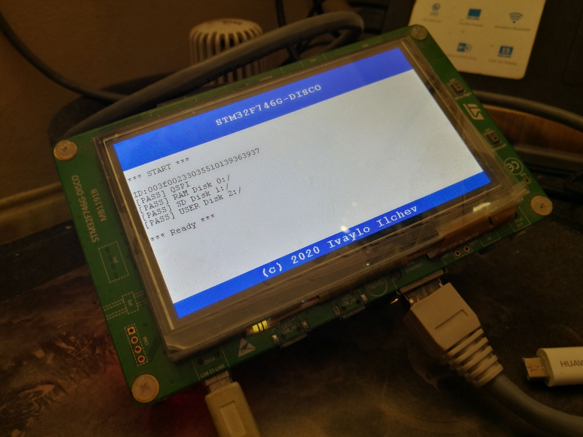
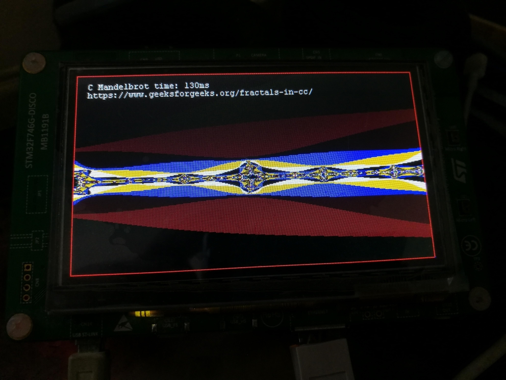
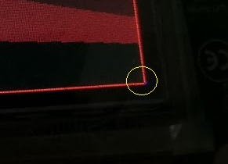
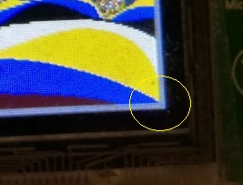

Stm32CubeIDE Template for Disco F746
--------------------------------------

### Board *Disco F746*

### Stm32CubeIDE 1.21
 
### Stm32CubeProgrammer 2.3.1

### LCD Log 

### C Fractal 

### BSP_LCD_DrawRect bug 

New function created BSP_LCD_DrawRectEx

 
